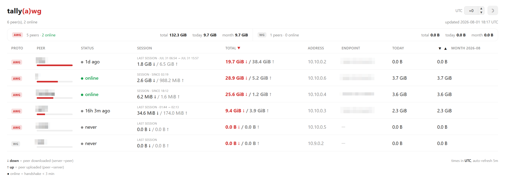

# tally(a)wg

`wg show` only counts bytes **since the interface last came up**, so the per-peer counters reset on every restart and reboot. **tally(a)wg** snapshots them on a timer, accumulates **reset-aware deltas** in a small JSON ledger, and shows per-peer **total / month / today** usage that survives restarts — in the terminal or the browser.

The `(a)` is optional: `tallywg` for WireGuard, `tallyawg` for AmneziaWG.

In the terminal (`tallyawg report`):

```
PEER            ADDRESS     TOTAL down   TOTAL up    MONTH 2026-06   TODAY
laptop          10.8.1.3    12.4 GiB     2.1 GiB     9.8 GiB         420.5 MiB
phone           10.8.1.2    830.0 MiB    44.0 MiB    512.0 MiB       12.0 MiB
```

The web page (`tallyawg serve`) shows totals plus live status — online / last handshake, current session, and endpoint:



## Features

- Per-peer **total / month / today**, persistent across restarts and reboots.
- **Reset-aware** — detects counter resets and keeps accumulating correctly.
- **Live view** — who's online, last handshake, current session, and endpoint.
- **Web page** with a light/dark theme, timezone offset, sortable columns, and month-by-month history; your preferences are remembered.
- Friendly peer names from `# name` comments in the server config, or a names file.
- A CLI report **and** a built-in web page — pick either or both.
- Single static binary, stdlib only. Works with both `wg` and `awg`.

## Usage

```sh
tallyawg            # report: per-peer total / month / today
tallyawg serve      # collector loop + web page (default 127.0.0.1:8082)
tallyawg collect    # take one snapshot (e.g. from cron)
```

Common flags: `-i <iface>`, `-config <server.conf>` (peer names), `-data <ledger.json>`; `serve` adds `-listen` and `-interval`. `down` = peer download (server → peer), `up` = peer upload.

## Install (Linux)

Reading the wg/awg counters needs **root**. Both ways install tally(a)wg as a systemd service that survives reboots.

**From a release** — no clone or Go needed. The binary installs itself: it carries the systemd unit and the config template inside. 

```sh
# grab tallyawg_linux_amd64.tar.gz (or _arm64) from the latest release, then:
tar xzf tallyawg_linux_amd64.tar.gz
sudo ./tallyawg install
```

**From source** (needs Go 1.23+):

```sh
git clone https://github.com/blackkriger/tally-a-wg
cd tally-a-wg
make linux
sudo ./tallyawg-linux-amd64 install
```

Either way, `install` copies the binary to `/usr/local/bin/tallyawg`, writes `/etc/tallyawg/tallyawg.env` (keeping yours if it already exists), enables `tallyawg.service` and restarts it — so running it again is also how you upgrade. `sudo tallyawg uninstall` removes the service and the binary, keeping the ledger and your config. Set your flags in the env file and restart:

```sh
# edit TALLYAWG_FLAGS in /etc/tallyawg/tallyawg.env, then:
sudo systemctl restart tallyawg
sudo systemctl status tallyawg
```

With no `-i`, every up wg/awg interface is auto-detected and read with the tool that supports it. Add `-config <server.conf>` for peer names and `-listen 0.0.0.0:8082` to reach the page from your tunnel — it binds to localhost by default, so keep the port firewalled to the wg/awg interface.

Prefer to run it by hand, without a service? Just run the binary:

```sh
sudo ./tallyawg serve -config /etc/wireguard/wg0.conf -listen 0.0.0.0:8082
```

## Building

Static assets are embedded via `go:embed`, so a plain Go build bundles the web page too — no Node.js toolchain. Requires Go 1.23+ 

```sh
make          # build ./tallyawg for the host
make dist     # cross-build every platform into dist/ + SHA256SUMS
```


## License

The MIT License (MIT). See [LICENSE](LICENSE) for details.
